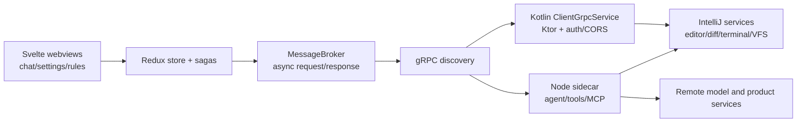
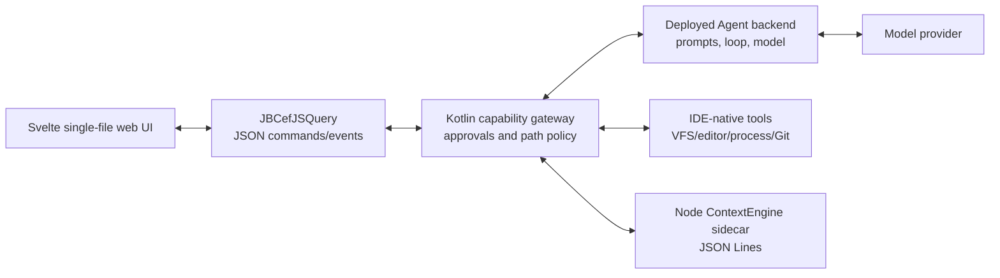

# CodeAgent architecture

## Product position

CodeAgent is an **IDE-native AI coding agent with a local-first context layer**. The agent is the primary workflow: it plans, retrieves context, calls tools, proposes edits, runs checks, and stops for approval before risky actions. ContextEngine is the retrieval substrate that makes the agent useful on unfamiliar and larger repositories.

This is deliberately narrower than an "AI coding platform". The first product boundary is one JetBrains project and one user. Provider-specific protocol adapters are isolated in the deployed backend; external systems and team control planes can be added through MCP after the local loop is reliable.

## What the Augment sample does

The analysis is based on the local `0.482.3` plugin archive, its manifest, Kotlin class surface, bundled sidecar, and webview source maps. No extracted Augment code or branded asset is part of this repository.

The webview does not directly manipulate the IDE. Its `MessageBroker` posts typed messages to a host interface. A `grpcInitializationRequest` asks the extension for service discovery data and an auth token. The frontend then builds Connect transports for either a local gRPC URL or a direct in-process implementation. Calls are split between:

- IDE-host messages: open/resolve files, selections, clipboard, notifications, terminal visibility, dialogs, and panel actions.
- Sidecar services: conversations, streaming, tools, tasks, rules, skills, hooks, plugins, MCP, analytics, and agent edit state.
- Remote services reached by the sidecar: model inference, account/subscription, integrations, and shared product services.

On JetBrains, `SidecarService` owns the Node process and registers native callbacks for editor, VFS, diff, diagnostics, Git, and terminal operations. The local `ClientGrpcService` exposes IDE-owned routes through Ktor with explicit authorization and CORS plugins. This gives Augment a three-process topology: JCEF renderer, IntelliJ JVM, and Node sidecar.

## CodeAgent topology

CodeAgent keeps the process separation and makes the Agent service independently deployable:

The UI-to-JVM protocol uses small versioned JSON envelopes. Long work is acknowledged immediately and reported as events, so the JCEF callback thread never blocks. The ContextEngine process has a separate JSON Lines protocol because it owns Node 22's SQLite state and can be restarted independently.

Agent prompts, model credentials, the bounded model/tool loop, and tool-call sequencing are owned by the deployed backend. The JVM advertises an allowlist of tools and independently enforces mode capabilities, project paths, and approvals. The Webview cannot provide system instructions or execute tools. See the [prompt and agent architecture](PROMPT_ARCHITECTURE.md) for the trust model.

The JVM discovers `.codeagent/rules/*.md`, `.codeagent/skills/*/SKILL.md`, compatible `.agents/skills/*/SKILL.md`, and root `AGENTS.md` after canonical-path validation. The Webview handles only display metadata and selected IDs. The JVM resolves those IDs again, then sends bounded content to the backend as lower-priority workspace data for server-side prompt composition.

The plugin discovers the backend's allowlisted models, persists the selected model per thread, and opens an authenticated SSE run with that model ID. The backend selects a provider adapter, assembles provider-specific deltas, and emits one normalized stream of assistant and tool-request events. The JVM executes only advertised tools, then returns results through a separate authenticated endpoint so orchestration can resume.

File mutations create JVM-only before/after snapshots. The Webview receives only a tool ID and project-relative path, then asks the JVM to open IntelliJ's native Diff viewer or revert the change. Revert is allowed only while the current editor or disk content exactly matches the recorded agent output, preventing an older checkpoint from overwriting newer user work. Terminal side effects are intentionally excluded because their changed-file set cannot be inferred safely.

## ContextEngine reuse decision

`lixiang12345/ContextEngine-plugin` is reusable under MIT. Its public `ContextEngine` API and MCP tools already cover the required retrieval loop:

- incremental workspace indexing;
- hybrid symbol/path/FTS/optional semantic retrieval;
- task-context packing under a token budget;
- file context and index status.

The integration is a pinned Git submodule compiled into the Node sidecar. CodeAgent does not fork or rewrite the retrieval algorithms. The plugin process boundary is intentional because ContextEngine requires Node `>=22.5` and `node:sqlite`; embedding that lifecycle in the JVM would create a second, weaker implementation.

## Security boundary

- Model API keys exist only in the deployed backend. The backend token is stored through IntelliJ Password Safe.
- File tools resolve canonical paths and reject access outside the current project.
- Chat and Ask modes are read-only.
- Writes and terminal commands always require local user approval.
- The webview has no direct filesystem, process, credential, or network authority.
- Repository content, attachments, retrieval output, and tool output remain lower-trust model context; executable authority is enforced in JVM code.

## Delivered phases

1. Plugin shell: buildable tool window, JCEF/Swing fallback, typed bridge, frontend state. (`202aa59`)
2. Context: pinned ContextEngine, index status/progress, retrieval tool, Node health checks. (`22ef1d2`)
3. Agent: OpenAI-compatible tool loop, IDE tools, approval/cancel semantics, edit summaries. (`27e5c3c`)
4. Product hardening: Password Safe settings, persisted tasks, attachments, tests, Plugin Verifier, and packaged distribution.
5. Backend prompt policy: versioned prompt resources, mode policy, and lower-priority root `AGENTS.md` guidance. (`60db5c3`)
6. Stream and change review: SSE response/tool-call streaming plus native Diff and guarded file revert. (`e89cc6a`, `933111f`)
7. Repository customization: always-on Rules, per-task selectable Skills, bounded prompt composition, and responsive UI. (`c4c8a0d`)
8. Deployed backend boundary: server-owned prompts/model loop and a JVM capability gateway connected through authenticated SSE.
9. Native provider routing: fixed model allowlist, OpenAI/xAI Responses adapters, Anthropic Messages adapter, and per-thread model selection.

The enabled model transports use native protocols rather than inferring a protocol from a model name: OpenAI and xAI use `/v1/responses`, while Anthropic uses `/v1/messages`. Provider event types and streamed function arguments are normalized before the agent loop sees them. See [provider and data flow](PROVIDER_AND_DATA_FLOW.md).
