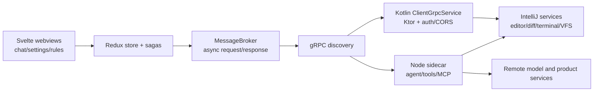
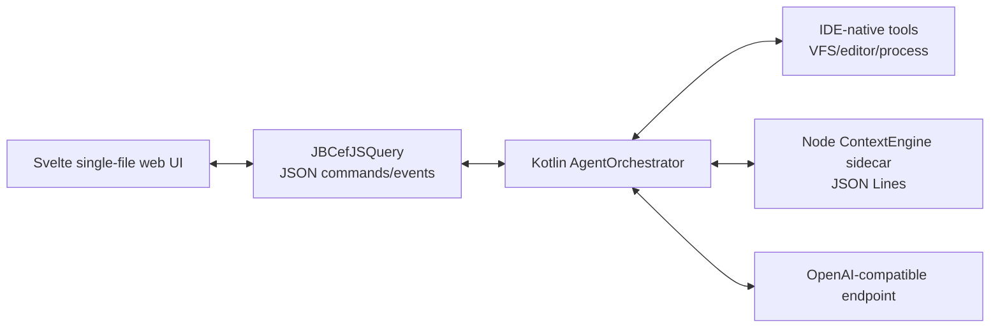

# CodeAgent architecture

## Product position

CodeAgent is an **IDE-native AI coding agent with a local-first context layer**. The agent is the primary workflow: it plans, retrieves context, calls tools, proposes edits, runs checks, and stops for approval before risky actions. ContextEngine is the retrieval substrate that makes the agent useful on unfamiliar and larger repositories.

This is deliberately narrower than an "AI coding platform". The first product boundary is one JetBrains project, one user, and OpenAI-compatible model endpoints. External systems and team control planes can be added through MCP after the local loop is reliable.

## What the Augment sample does

The analysis is based on the local `0.482.3` plugin archive, its manifest, Kotlin class surface, bundled sidecar, and webview source maps. No extracted Augment code or branded asset is part of this repository.

The webview does not directly manipulate the IDE. Its `MessageBroker` posts typed messages to a host interface. A `grpcInitializationRequest` asks the extension for service discovery data and an auth token. The frontend then builds Connect transports for either a local gRPC URL or a direct in-process implementation. Calls are split between:

- IDE-host messages: open/resolve files, selections, clipboard, notifications, terminal visibility, dialogs, and panel actions.
- Sidecar services: conversations, streaming, tools, tasks, rules, skills, hooks, plugins, MCP, analytics, and agent edit state.
- Remote services reached by the sidecar: model inference, account/subscription, integrations, and shared product services.

On JetBrains, `SidecarService` owns the Node process and registers native callbacks for editor, VFS, diff, diagnostics, Git, and terminal operations. The local `ClientGrpcService` exposes IDE-owned routes through Ktor with explicit authorization and CORS plugins. This gives Augment a three-process topology: JCEF renderer, IntelliJ JVM, and Node sidecar.

## CodeAgent topology

CodeAgent keeps the useful separation but reduces the protocol surface:

The UI-to-JVM protocol uses small versioned JSON envelopes. Long work is acknowledged immediately and reported as events, so the JCEF callback thread never blocks. The ContextEngine process has a separate JSON Lines protocol because it owns Node 22's SQLite state and can be restarted independently.

## ContextEngine reuse decision

`lixiang12345/ContextEngine-plugin` is reusable under MIT. Its public `ContextEngine` API and MCP tools already cover the required retrieval loop:

- incremental workspace indexing;
- hybrid symbol/path/FTS/optional semantic retrieval;
- task-context packing under a token budget;
- file context and index status.

The integration is a pinned Git submodule compiled into the Node sidecar. CodeAgent does not fork or rewrite the retrieval algorithms. The plugin process boundary is intentional because ContextEngine requires Node `>=22.5` and `node:sqlite`; embedding that lifecycle in the JVM would create a second, weaker implementation.

## Security boundary

- API keys are stored through the IntelliJ Password Safe, never in project files or web storage.
- File tools resolve canonical paths and reject access outside the current project.
- Ask mode is read-only.
- Writes and terminal commands require approval unless the user explicitly enables per-thread auto approval.
- The webview has no direct filesystem, process, credential, or network authority.

## Delivered phases

1. Plugin shell: buildable tool window, JCEF/Swing fallback, typed bridge, frontend state. (`202aa59`)
2. Context: pinned ContextEngine, index status/progress, retrieval tool, Node health checks. (`22ef1d2`)
3. Agent: OpenAI-compatible tool loop, IDE tools, approval/cancel semantics, edit summaries. (`27e5c3c`)
4. Product hardening: Password Safe settings, persisted tasks, attachments, tests, Plugin Verifier, and packaged distribution.

The current model transport uses a bounded non-streaming Chat Completions request for each agent turn. UI run state and tool progress are event-driven, but token-level model streaming is not part of `0.1.0`.
