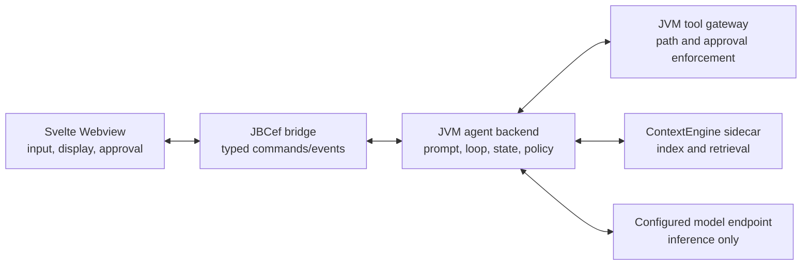

# Prompt and agent architecture

## Evidence from the analyzed Augment plugin

The local Augment `0.482.3` archive shows prompts at more than one layer, but it does not place the agent harness in the Webview.

| Layer | Observed responsibility |
| --- | --- |
| Webview | Draft text, starter questions, mode selection, context chips, rules/skills settings, approvals, and rendering |
| Node sidecar | Agent tool loop, tool descriptions, orchestration/subagent prompt extensions, rules, skills, personas, conversation history, and API request construction |
| Remote API | `chat-stream`, prompt enhancement, retrieval, model selection, and product services |

The sidecar contains complete orchestrator, synchronous subagent, and asynchronous subagent prompt extensions. Its `chatStream` request can send `system_prompt`, `system_prompt_append`, `system_prompt_replacements`, `user_guidelines`, `workspace_guidelines`, `rules`, `skills`, and persona identifiers.

`system_prompt` is optional while mode, model, rules, skills, and guidelines are sent independently. This is strong evidence that the remote service can select or compose a default model prompt. It is an inference from the client contract, not proof of the private server implementation.

## Decision for CodeAgent

The frontend is a view and control surface. The agent harness belongs to the backend.

For the local-first product, "backend" means the IntelliJ JVM process. It owns:

- prompt selection and composition;
- conversation and run state;
- the model/tool loop, cancellation, and turn limits;
- available tool definitions and mode-specific capabilities;
- approval policy and project path enforcement;
- retrieval decisions and model requests.

The Webview owns only user-authored text, visible starter prompts, selected context, mode controls, approval responses, and rendering. It cannot supply a system prompt, register a tool, lower a risk level, or execute a tool.

ContextEngine remains a retrieval process rather than the agent brain. The configured model endpoint performs inference but receives no direct local filesystem or process authority.

## Prompt layers

CodeAgent composes a versioned system prompt in this order:

1. Product identity and operating loop from packaged backend resources.
2. Non-overridable safety and authority policy.
3. Agent or Ask mode policy.
4. Optional repository-root `AGENTS.md` guidance, explicitly marked lower priority.
5. Always-on `.codeagent/rules/*.md` repository rules, with a bounded total prompt budget.
6. User-enabled repository Skills, resolved from backend-discovered IDs and bounded separately.
7. Conversation messages and user-selected file references as user content.
8. Retrieved files and tool results as untrusted tool data.

The prompt explains policy, but code enforces it. Ask mode does not receive mutating tools. File tools canonicalize paths. Mutations and terminal commands require host approval. A prompt injection therefore cannot grant itself a capability.

Prompt version `2026-07-13.2` keeps Rules and Skills below product safety and mode policy. Rule and skill text can guide conventions and methods, but it cannot register tools, change risk levels, bypass approvals, or make Ask mode writable. New packaged instructions should be added only for observed failures backed by tests or evaluations; copying every prompt found in another product would increase context cost and brittleness.

## Future hosted architecture

If CodeAgent later adds a hosted Agent service, the model-side harness, prompt versions, conversation state, evaluations, and rollout controls should move to that service. The IntelliJ JVM should remain an authenticated local capability gateway that owns IDE access and independently enforces user approvals. The Webview should still remain presentation-only.

## External guidance used

- [OpenAI Agents SDK overview](https://developers.openai.com/api/docs/guides/agents) describes the server as the owner of deployment, tool implementations, state storage, approvals, and the agent loop.
- [OpenAI agent definitions](https://developers.openai.com/api/docs/guides/agents/define-agents) groups instructions, tools, guardrails, handoffs, and outputs into the agent definition.
- [Anthropic context engineering](https://www.anthropic.com/engineering/effective-context-engineering-for-ai-agents) recommends a minimal, high-signal system prompt and just-in-time context rather than exhaustive prompt stuffing.
- [OWASP AI Agent Security](https://cheatsheetseries.owasp.org/cheatsheets/AI_Agent_Security_Cheat_Sheet.html) recommends least-privilege tools, explicit authorization for sensitive operations, and treating external data as untrusted.
