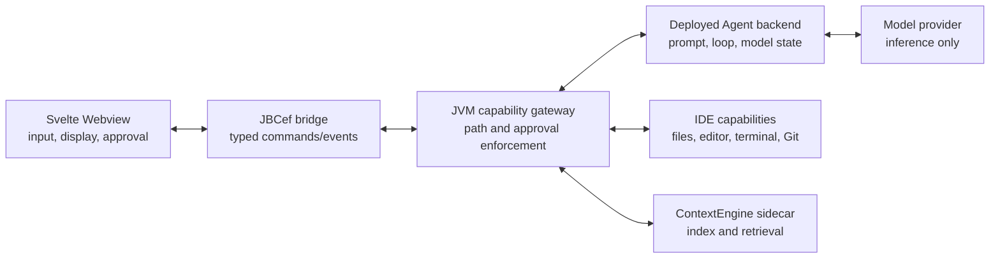

# Prompt and agent architecture

## Evidence from the analyzed Augment plugin

The local Augment `0.482.3` archive shows prompts at more than one layer, but it does not place the agent harness in the Webview.

| Layer | Observed responsibility |
| --- | --- |
| Webview | Draft text, starter questions, mode selection, context chips, rules/skills settings, approvals, and rendering |
| Node sidecar | Agent tool loop, tool descriptions, orchestration/subagent prompt extensions, rules, skills, personas, conversation history, and API request construction |
| Remote API | `chat-stream`, prompt enhancement, retrieval, model selection, and product services |

The sidecar contains complete orchestrator, synchronous subagent, and asynchronous subagent prompt extensions. Its `chatStream` request can send `system_prompt`, `system_prompt_append`, `system_prompt_replacements`, `user_guidelines`, `workspace_guidelines`, `rules`, `skills`, and persona identifiers.

`system_prompt` is optional while mode, model, rules, skills, and guidelines are sent independently. This is strong evidence that the remote service can select or compose a default model prompt. It is an inference from the client contract, not proof of the private server implementation.

## Decision for CodeAgent

The frontend is a view and control surface. The agent harness belongs to the backend.

The separately deployed backend owns:

- prompt selection and composition;
- model credentials and run state;
- the model/tool loop, cancellation, and turn limits;
- tool-call sequencing and model requests.

The IntelliJ JVM owns the capability boundary:

- available tool definitions and mode-specific capabilities;
- approval policy and project path enforcement;
- local file, editor, terminal, Git, diagnostics, and ContextEngine execution;
- authenticated delivery of tool results to the backend.

The Webview owns only user-authored text, visible starter prompts, selected context, mode controls, approval responses, and rendering. It cannot supply a system prompt, register a tool, lower a risk level, or execute a tool.

ContextEngine remains a retrieval process rather than the agent brain. The configured model endpoint performs inference but receives no direct local filesystem or process authority.

## Prompt layers

The deployed backend composes the system prompt in this order:

1. Product identity and operating loop from backend-owned code.
2. Non-overridable safety and authority policy.
3. Explicit instruction-priority and bounded operating policy.
4. Context retrieval, tool-selection, task lifecycle, delegation, completion, and capability-boundary policy.
5. Agent, Chat, or Ask mode policy.
6. The selected Agent profile type and its optional account-scoped custom instructions.
7. The currently active tool names and discovery guidance.
8. Optional repository-root `AGENTS.md` guidance, explicitly marked lower priority.
9. Always-on and selected `.codeagent/rules/*.md` repository rules, with a bounded total prompt budget.
10. User-enabled repository Skills, resolved from backend-discovered IDs and bounded separately.
11. The compact conversation summary.
12. Conversation messages, attachments, retrieved files, and tool results as lower-trust run data.

The prompt explains policy, but code enforces it. Chat and Ask remove every mutating local, backend, and MCP definition before the request is sent, and the JVM rejects a mutating tool request again before execution. File tools canonicalize paths. Mutations and terminal commands require host approval. A prompt injection therefore cannot grant itself a capability.

Task-list mutation has a runtime completion gate. After `add_tasks`, `update_tasks`, or `reorg_tasks`, the model must call `view_tasks` before it can finish; one reminder turn is allowed, then the run fails closed. The prompt separately requires created or changed tasks to be completed or cancelled unless the run is genuinely blocked.

The synchronous `subagent` is a bounded model-only delegation for `research`, `review`, `test`, `security`, or `planner` analysis. It receives an explicit delegated task and output contract, has no IDE tools, and cannot edit files, execute commands, request approval, or certify tests. The parent Agent remains responsible for evidence inspection, implementation, verification, and the final decision.

Rules and Skills remain below product safety and mode policy. Their text can guide conventions and methods, but it cannot register tools, change risk levels, bypass JVM approvals, or make Chat/Ask mode writable. The plugin package contains no Agent system prompt or model credential.

The backend may be self-hosted or product-hosted without changing the plugin trust boundary. The IntelliJ JVM remains an authenticated local capability gateway and the Webview remains presentation-only.

## External guidance used

- [OpenAI Agents SDK overview](https://developers.openai.com/api/docs/guides/agents) describes the server as the owner of deployment, tool implementations, state storage, approvals, and the agent loop.
- [OpenAI agent definitions](https://developers.openai.com/api/docs/guides/agents/define-agents) groups instructions, tools, guardrails, handoffs, and outputs into the agent definition.
- [Anthropic context engineering](https://www.anthropic.com/engineering/effective-context-engineering-for-ai-agents) recommends a minimal, high-signal system prompt and just-in-time context rather than exhaustive prompt stuffing.
- [OWASP AI Agent Security](https://cheatsheetseries.owasp.org/cheatsheets/AI_Agent_Security_Cheat_Sheet.html) recommends least-privilege tools, explicit authorization for sensitive operations, and treating external data as untrusted.
