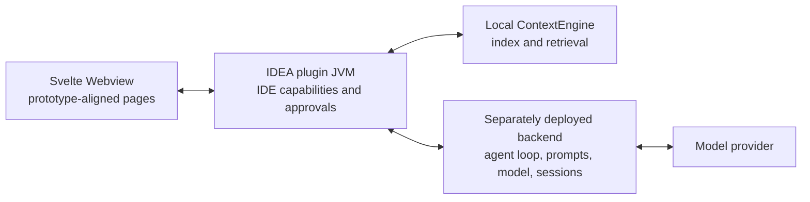

# Prototype parity contract

`prototypes/augment-v9-tools-native.html` is the product acceptance baseline. Earlier prototypes and the extracted `0.482.3` plugin are supporting evidence only. CodeAgent keeps its own name, deployment configuration, and security policy, but reproduces the prototype's page structure, icon vocabulary, information density, states, and workflows.

This document is the only human-readable source of current implementation
status. Its machine-readable companion is `evaluation/parity-codeagent.json`;
`node scripts/evaluate-parity.mjs` checks stable structural contracts and writes
`build/reports/prototype-parity.json`. The structural gate does not replace the
native IDE smoke, Plugin Verifier, or live provider acceptance evidence. The
browser-level 360/420/640 px references live under
`frontend/e2e/__screenshots__` and run through `npm run test:e2e --prefix frontend`.

## Deployment boundary

The deployed backend owns prompts, model credentials, the bounded agent loop, streamed assistant output, task orchestration, and tool-call sequencing. The plugin owns project files, editor, diagnostics, terminal, Git, ContextEngine, user approval, and canonical path enforcement. The Webview owns rendering and user interaction only.

## Page and state acceptance

| Surface | Required prototype behavior |
| --- | --- |
| Main panel | Native tool-window header, active-thread header, context/repository strip, dense transcript, streamed thinking/answer states, bottom composer |
| Threads | Overlay drawer, search, Agent/Chat/Ask tags, create/select, pin/delete/export/import entry points |
| Composer | Agent/Chat/Ask selector, attachments, mentions, commands, Skills, model/auto controls, queue/stop/send states, adaptive input, and user-message edit/resend |
| Tools | Prototype card anatomy, expandable details, phase/status, approvals, file paths, Diff/open/revert, terminal actions |
| Agent edits | Changed-file summary, review, keep/discard, checkpoints, per-file Diff and undo |
| Tasks | Task tree, add/view/update/reorganize states, run/clear/import/export controls |
| Subagents | Synchronous and asynchronous run states, approval, stop, output navigation |
| Git | Unstaged and reviewed groups, stage/unstage, generated commit message, commit action |
| Settings | Home, Services, MCP, Rules, API keys, Commands, Skills, Hooks, Agents, Plugins, UX, feature flags, Beta, account, subscription |
| Rules editor | Description, Always/Manual/Agent trigger, Markdown editor, save/open/back actions |
| Image Canvas | Directory selection, refresh/settings, gallery, mention/open actions and empty states |
| Mermaid | Diagram/code modes, zoom, fit, open-in-tab and render failure state |
| IDE integration | Tool window, actions, status/completion states, file/editor/terminal/Git navigation |

## Current implementation status

This table is the release gate. `Partial` means the visible surface exists but at least one prototype workflow is still intentionally unavailable.

| Surface | Status | Real behavior in the current build |
| --- | --- | --- |
| Main panel | Implemented | 420 px IDEA tool window, interleaved user/assistant/tool timeline, context strip, tool cards, approvals, composer, stop/send states |
| Threads | Implemented | Create, select, search, mode tags, active run/approval/failure indicators, persisted unread reply counts, pin ordering, confirmed delete, and Markdown import/export work |
| Composer | Implemented | Modes, attachments, Skills, model picker, queue/stop/send, slash menu, @ mention menu, Auto, real prompt enhancement via backend `/v1/enhance`, adaptive input height, and persisted user-message edit/resend that safely rewinds later transcript/tool history before rerunning |
| Tools | Conditional | Local tools remain IDEA-owned; dedicated detail presentations preserve file/diff, retrieval/search, Web, provider integration, task, subagent/Ask User, diagnostics, terminal/process, and Mermaid result structure. Bounded foreground commands plus managed launch/list/read/write/wait/kill process sessions use the original terminal argument contract, support project-contained working directories and interactive-input detection, backend-owned discovery/execution connects configured cloud adapters and subagents, and the local MCP gateway contributes dynamically discovered namespaced tools under the same policy |
| Agent edits | Implemented | Native Diff, undo, keep/discard, Agent Edits overlay, and local checkpoints with restore |
| Tasks | Implemented | Persistent per-thread tasks, filtering, add/delete/state, clear, Markdown import/export, run-one/run-all, and Agent task tools |
| Git | Implemented | Real branch/index/worktree status, stage/unstage, native Diff, local message draft, confirmation, and commit |
| Rules editor | Implemented | Repository Markdown, persisted description and trigger metadata, save, and manual per-thread selection work |
| Image Canvas | Implemented | Project-contained directory selection, bounded raster gallery, settings, refresh, open, mention, and empty/error states |
| Mermaid | Implemented | Strict rendering, diagram/code, zoom, fit, error states, and opening source in an IDEA editor tab work |
| Settings | Implemented | Backend health, account, subscription usage, ContextEngine, Rules, Skills, persisted chat zoom/timestamps/run telemetry/native notifications, Commands, Hooks, Agent profiles, declarative plugin lifecycle, MCP lifecycle controls, feature/Beta capability reports, and a redacted live runtime audit are real |
| Tools catalog / Icon gallery / Feedback | Implemented | UI overlays provide insert-tool seeding, icon name copy, local feedback notes, and a bounded support bundle containing a redacted runtime audit plus explicitly requested conversation context |
| Cloud integrations | Conditional | Search/read adapters are advertised only when their backend environment is configured; provider errors and missing credentials remain explicit failures |
| Subagents | Implemented | Synchronous `subagent` plus durable asynchronous jobs support persisted partial output, polling progress, cancellation, retry, composer handoff, and read-only IDE result navigation |
| MCP | Implemented | Enabled stdio, Streamable HTTP, and legacy SSE definitions are reconciled by a local managed gateway with health checks, bounded reconnects, explicit start/stop/restart/test controls, tool-list refresh notifications, environment allowlisting, bearer-token injection, namespaced Agent tools, approval-aware risk defaults, PKCE OAuth authorization-code flow, Password Safe token storage, refresh, and callback state validation |
| Plugins | Implemented | Account-synchronized plugin definitions drive explicit per-device install, validate, update, and uninstall actions for bounded declarative manifests. All eight declared capability types are typed and validated: commands/prompts feed slash workflows, rules/skills feed bounded workspace context, Agent profiles are request-scoped, Hooks/MCP reuse supervised runtimes, and Tools are approval-preserving aliases over existing handlers |

## Native parity and intentional architecture differences

The current plugin registers the original action and extension surface that is meaningful in this product boundary: **33 IDEA Actions**, **26 IntelliJ extensions**, and **4 application/project listeners**, including the standalone settings sections, sign-in/sign-out, account management, log export, cloud conversation recovery, sync report, BYOK actions, FileBasedIndex, inline-completion element manipulation, OAuth/MCP callback handlers, lifecycle listeners, and error/performance/client telemetry services.

ACP is implemented through the official `@agentclientprotocol/sdk` v1 runtime in the sidecar, with agent discovery, capability negotiation, `session/new`, `session/load`, prompt/update/cancel handling, persisted session state, and explicit permission denial as the default safety boundary.

The build also supports a managed Node 22 runtime manifest for darwin, win32, and linux x64/arm64 targets. Downloads are HTTPS-only, SHA-256 pinned, bounded in size, protected against archive path traversal, and installed atomically. The backend accepts either `RUNTIME_MANIFEST_JSON` or an HTTPS `RUNTIME_MANIFEST_URL`.

The original Augment package's private protobuf definitions, `classic-level.node`, and roughly 115 MB of generated protocol dependencies are not copied. CodeAgent now uses its own versioned Protobuf/gRPC contract for the authenticated JVM-to-sidecar boundary, plus a documented HTTP/SSE backend, a typed JVM bridge, the official MCP/ACP runtimes, and the open ContextEngine implementation. This is protocol-level architectural alignment, not a claim of wire compatibility with private Augment services. Cloud integrations remain configuration-dependent and are reported unavailable until their credentials and endpoints are present.

Plugin Verifier runs against the targeted IntelliJ IDEA Community 2025.2.6.2 platform and any configured local JetBrains IDEs. The current release has also passed PyCharm 2026.1.2 (`PY-261.24374.152`) with the same result: compatible, with only the 12 expected Inline Completion experimental-API notices. Additional local products can be added through `-PcodeagentVerifierIdePaths=/path/to/IDE,/path/to/another/IDE`; WebStorm, CLion, and products not present in the executed matrix remain explicitly unverified.

## Tool catalog

The prototype defines 31 tool presentations. A card is shown as functional only when its backend or IDE capability is connected:

`context-engine`, `conversation-retrieval`, `str-replace`, `view`, `read-file`, `save-file`, `remove-files`, `apply-patch`, `grep`, `shell`, `web-fetch`, `web`, `open-browser`, `diagnostics`, `git-commit`, `mermaid`, `add-tasks`, `view-tasks`, `update-tasks`, `reorg-tasks`, `subagent`, `async-subagent`, `ask-user`, `github`, `linear`, `notion`, `jira`, `confluence`, `glean`, `supabase`, `mcp`.

Backend tools are discovered through authenticated `GET /v1/tools`. The JVM advertises only entries with `available=true` and proxies execution through `POST /v1/tools/{toolName}`. Required environment is documented in `backend/.env.example`; unavailable entries include a concrete reason and cannot be executed.

## Resource contract
- Use the icon names and placement from the v9 registry (`prototypes/assets/icons-registry.js`), shipped as `frontend/src/lib/icons.ts` and rendered through `frontend/src/lib/Icon.svelte`.
- Reuse the provided prototype status, service, and product image resources when licensing permits redistribution.
- Use prototype design tokens: compact 10/12/14 px type, JetBrains Mono for tool data, neutral IntelliJ surfaces (`--bg/#1e1e1e`, `--panel/#252526`, `--chrome/#3c3f41`, accent `#3574f0`), and 4-8 px radii.
- Validate at a 420 px tool-window viewport first (`--tw: 420px`), then 360 px and wider docked widths.
- Page chrome mirrors v9: tool-window header, chat header with context meter + zoom, repository chip strip, composer action bar (mode/model/canvas/@/slash/attach/enhance/auto/send), threads drawer, and overlay pages for Tasks / Git Changes / Context Canvas / Settings.

## No-fake rule

Unconnected cloud integrations may appear only as explicitly unavailable configuration rows. Buttons, approvals, tool cards, and success states must not claim an operation completed unless a real backend or IDEA capability performed it.
