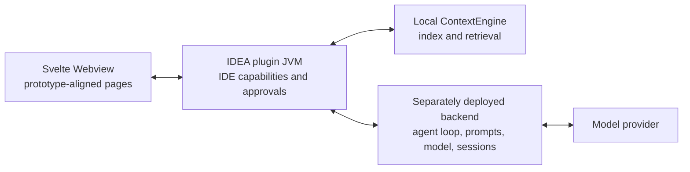

# Prototype parity contract

`prototypes/augment-v9-tools-native.html` is the product acceptance baseline. Earlier prototypes and the extracted `0.482.3` plugin are supporting evidence only. CodeAgent keeps its own name, deployment configuration, and security policy, but reproduces the prototype's page structure, icon vocabulary, information density, states, and workflows.

## Deployment boundary

The deployed backend owns prompts, model credentials, the bounded agent loop, streamed assistant output, task orchestration, and tool-call sequencing. The plugin owns project files, editor, diagnostics, terminal, Git, ContextEngine, user approval, and canonical path enforcement. The Webview owns rendering and user interaction only.

## Page and state acceptance

| Surface | Required prototype behavior |
| --- | --- |
| Main panel | Native tool-window header, active-thread header, context/repository strip, dense transcript, streamed thinking/answer states, bottom composer |
| Threads | Overlay drawer, search, Agent/Chat/Ask tags, create/select, pin/delete/export/import entry points |
| Composer | Agent/Chat/Ask selector, attachments, mentions, commands, Skills, model/auto controls, queue/stop/send states |
| Tools | Prototype card anatomy, expandable details, phase/status, approvals, file paths, Diff/open/revert, terminal actions |
| Agent edits | Changed-file summary, review, keep/discard, checkpoints, per-file Diff and undo |
| Tasks | Task tree, add/view/update/reorganize states, run/clear/import/export controls |
| Subagents | Synchronous and asynchronous run states, approval, stop, output navigation |
| Git | Unstaged and reviewed groups, stage/unstage, generated commit message, commit action |
| Settings | Home, Services, MCP, Rules, API keys, Commands, Skills, Hooks, Agents, Plugins, UX, feature flags, Beta, account, subscription |
| Rules editor | Description, Always/Manual/Agent trigger, Markdown editor, save/open/back actions |
| Image Canvas | Directory selection, refresh/settings, gallery, mention/open actions and empty states |
| Mermaid | Diagram/code modes, zoom, fit, open-in-tab and render failure state |
| IDE integration | Tool window, actions, status/completion states, file/editor/terminal/Git navigation |

## Current implementation status

This table is the release gate. `Partial` means the visible surface exists but at least one prototype workflow is still intentionally unavailable.

| Surface | Status | Real behavior in the current build |
| --- | --- | --- |
| Main panel | Implemented | 420 px IDEA tool window, interleaved user/assistant/tool timeline, context strip, tool cards, approvals, composer, stop/send states |
| Threads | Implemented | Create, select, search, mode tags, pin ordering, confirmed delete, and Markdown import/export work |
| Composer | Implemented | Modes, attachments, Skills, model picker, queue/stop/send, slash menu, @ mention menu, Auto, and real prompt enhancement via backend `/v1/enhance` |
| Tools | Partial | Local tools now include conversation retrieval, remove/apply-patch, web-fetch, open-browser, ask-user plus the previous VFS/terminal/Git/task/mermaid set; catalog still marks cloud/MCP/subagent integrations unavailable |
| Agent edits | Implemented | Native Diff, undo, keep/discard, Agent Edits overlay, and local checkpoints with restore |
| Tasks | Implemented | Persistent per-thread tasks, filtering, add/delete/state, clear, Markdown import/export, run-one/run-all, and Agent task tools |
| Git | Implemented | Real branch/index/worktree status, stage/unstage, native Diff, local message draft, confirmation, and commit |
| Rules editor | Implemented | Repository Markdown, persisted description and trigger metadata, save, and manual per-thread selection work |
| Image Canvas | Implemented | Project-contained directory selection, bounded raster gallery, settings, refresh, open, mention, and empty/error states |
| Mermaid | Implemented | Strict rendering, diagram/code, zoom, fit, error states, and opening source in an IDEA editor tab work |
| Settings | Partial | All prototype navigation sections render; backend health, services/token, ContextEngine, Rules, Skills, and chat zoom UX are real; MCP and remaining sections stay explicit shells |
| Tools catalog / Icon gallery / Feedback | Implemented | UI overlays for insert-tool seeding, icon name copy, and local feedback notice |
| Subagents and cloud integrations | Unavailable | No success state is simulated; these require separately deployed capability providers and protocol work |

## Tool catalog

The prototype defines 31 tool presentations. A card is shown as functional only when its backend or IDE capability is connected:

`context-engine`, `conversation-retrieval`, `str-replace`, `view`, `read-file`, `save-file`, `remove-files`, `apply-patch`, `grep`, `shell`, `web-fetch`, `web`, `open-browser`, `diagnostics`, `git-commit`, `mermaid`, `add-tasks`, `view-tasks`, `update-tasks`, `reorg-tasks`, `subagent`, `async-subagent`, `ask-user`, `github`, `linear`, `notion`, `jira`, `confluence`, `glean`, `supabase`, `mcp`.

## Resource contract
- Use the icon names and placement from the v9 registry (`prototypes/assets/icons-registry.js`), shipped as `frontend/src/lib/icons.ts` and rendered through `frontend/src/lib/Icon.svelte`.
- Reuse the provided prototype status, service, and product image resources when licensing permits redistribution.
- Use prototype design tokens: compact 10/12/14 px type, JetBrains Mono for tool data, neutral IntelliJ surfaces (`--bg/#1e1e1e`, `--panel/#252526`, `--chrome/#3c3f41`, accent `#3574f0`), and 4-8 px radii.
- Validate at a 420 px tool-window viewport first (`--tw: 420px`), then 360 px and wider docked widths.
- Page chrome mirrors v9: tool-window header, chat header with context meter + zoom, repository chip strip, composer action bar (mode/model/canvas/@/slash/attach/enhance/auto/send), threads drawer, and overlay pages for Tasks / Git Changes / Context Canvas / Settings.

## No-fake rule

Unconnected cloud integrations may appear only as explicitly unavailable configuration rows. Buttons, approvals, tool cards, and success states must not claim an operation completed unless a real backend or IDEA capability performed it.
