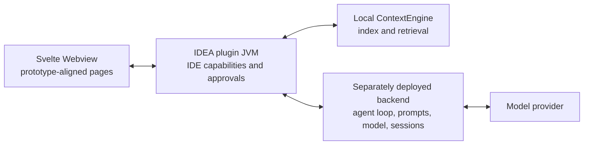

# Prototype parity contract

`prototypes/augment-v9-tools-native.html` is the product acceptance baseline. Earlier prototypes and the extracted `0.482.3` plugin are supporting evidence only. CodeAgent keeps its own name, deployment configuration, and security policy, but reproduces the prototype's page structure, icon vocabulary, information density, states, and workflows.

This document is the only human-readable source of current implementation
status. Its machine-readable companion is `evaluation/parity-codeagent.json`;
`node scripts/evaluate-parity.mjs` checks stable structural contracts and writes
`build/reports/prototype-parity.json`. The structural gate does not replace the
native IDE smoke, Plugin Verifier, or live provider acceptance evidence. The
browser-level 360/420/640 px references live under
`frontend/e2e/__screenshots__` and run through `npm run test:e2e --prefix frontend`.

## Deployment boundary

```mermaid
flowchart LR
    UI["Svelte Webview\nprototype-aligned pages"]
    JVM["IDEA plugin JVM\nIDE capabilities and approvals"]
    Context["Local ContextEngine\nindex and retrieval"]
    Backend["Separately deployed backend\nagent loop, prompts, model, sessions"]
    Model["Model provider"]

    UI <--> JVM
    JVM <--> Context
    JVM <--> Backend
    Backend <--> Model
```

The deployed backend owns prompts, model credentials, the bounded agent loop, streamed assistant output, task orchestration, and tool-call sequencing. The plugin owns project files, editor, diagnostics, terminal, Git, ContextEngine, user approval, and canonical path enforcement. The Webview owns rendering and user interaction only.

## Page and state acceptance

| Surface | Required prototype behavior |
| --- | --- |
| Main panel | Native tool-window header, active-thread header, context/repository strip, dense transcript, streamed thinking/answer states, and a bottom composer with model-adjacent Context Window Usage |
| Threads | Overlay drawer, search, time/pinned groups, Agent/Chat/Ask tags, create/select, row rename/pin/delete menus, confirmed group cleanup, and export/import entry points |
| Composer | Agent/Chat/Ask selector, attachments, mentions, commands, Skills, model/auto controls, queue/stop/send states, adaptive input, and user-message edit/resend |
| Tools | Prototype card anatomy, expandable details, phase/status, approvals, file paths, Diff/open/revert, terminal actions |
| Agent edits | Changed-file summary, review, keep/discard, checkpoints, per-file Diff and undo |
| Tasks | Task tree, add/view/update/reorganize states, run/clear/import/export controls |
| Subagents | Synchronous and asynchronous run states, approval, stop, output navigation |
| Git | Unstaged and reviewed groups, stage/unstage, generated commit message, commit action |
| Settings | Home, Services, MCP, Rules, API keys, Commands, Skills, Hooks, Agents, Plugins, UX, feature flags, Beta, account, subscription |
| Rules editor | Description, Always/Manual/Agent trigger, Markdown editor, save/open/back actions |
| Image Canvas | Directory selection, refresh/settings, gallery, mention/open actions and empty states |
| Mermaid | Diagram/code modes, zoom, fit, open-in-tab and render failure state |
| IDE integration | Tool window, actions, status/completion states, file/editor/terminal/Git navigation |

## Current implementation status

This table is the release gate. `Partial` means the visible surface exists but at least one prototype workflow is still intentionally unavailable.

| Surface | Status | Real behavior in the current build |
| --- | --- | --- |
| Main panel | Implemented | 420 px IDEA tool window, interleaved user/assistant/tool timeline, context strip, tool cards, approvals, composer, stop/send states, a clickable Context Window Usage ring with a bounded telemetry modal, and assistant code blocks with Copy plus Insert-into-active-editor actions |
| Threads | Implemented | Create, select, search, pinned/time groups, mode tags, row-level rename/pin/delete menus, confirmed row/group deletion, active run/approval/failure indicators, persisted unread reply counts, pin ordering, and Markdown import/export work. Task List `Continue in New Chat` clones task state and thread customization without copying transcript history |
| Composer | Implemented | Modes, attachments, Skills, model picker, slash menu, Auto, real prompt enhancement via backend `/v1/enhance`, adaptive input height, and persisted user-message edit/resend work. `@` searches indexed project files and produces removable mention chips whose tokens stay in sync with the text; files can be dropped onto the composer, and oversized pastes are refused with their size. The conversation-scoped queue has a composer-adjacent collapsible panel, pause/resume, edit, delete, priority send, Stop-without-loss, restart-safe paused recovery, and FIFO execution |
| Tools | Conditional | Local tools remain IDEA-owned; dedicated detail presentations preserve file/diff, retrieval/search, Web, provider integration, task, subagent/Ask User, diagnostics, terminal/process, and Mermaid result structure. Bounded foreground commands plus managed launch/list/read/write/wait/kill process sessions use the original terminal *argument* contract (execution is hosted by a plugin-managed process, not an IDE Run configuration), support project-contained working directories and interactive-input detection, backend-owned discovery/execution connects configured cloud adapters and subagents, and the local MCP gateway contributes dynamically discovered namespaced tools under the same policy. Each completed tool pass appends a compact per-turn summary strip counting changed/examined/indexed files, tools used, and elapsed seconds, derived from CodeAgent's own tool records. Long tool result output is bounded to 100 lines with an explicit Show more/Show less toggle instead of silently dropping the remainder. The Ask User tool accepts an optional list of suggested answers rendered as a chooser while still permitting a custom typed answer |
| Agent edits | Implemented | Native Diff, undo, keep/discard, Agent Edits overlay, and local checkpoints with restore and an expandable per-checkpoint changed-file breakdown with per-file added/removed line counts |
| Tasks | Implemented | Persistent per-thread tasks, one level of subtasks with parent-relative numbering and descriptions, filtering, add/delete/state, clear, Markdown import/export, run-one/run-all, and Agent task tools accepting `parent_task_id` and `after_task_id` |
| Git | Implemented | Real branch/index/worktree status, stage/unstage, native Diff, local message draft, confirmation, and commit |
| Rules editor | Implemented | Repository Markdown, editable `.codeagent/guidelines.md` included in Agent context after `AGENTS.md`, refresh, confirmed workspace-rule deletion with metadata cleanup, persisted description and trigger metadata, client-side filename/content validation, unsaved-change protection, save, native IDEA-editor handoff for the canonical guidelines file, and manual per-thread selection work |
| Image Canvas | Implemented | Project-contained directory selection, bounded raster gallery, settings, refresh, open, mention, and empty/error states |
| Mermaid | Implemented | Strict rendering, diagram/code, zoom, fit, error states, and opening source in an IDEA editor tab work |
| Settings | Implemented | Project Home exposes real index metrics plus distinct status-refresh/rebuild operations; Services groups backend capabilities by provider with explicit loading/ready/error/unavailable discovery, Ready/Partial/Unavailable summaries, per-capability risk/reason detail, and retry; backend health, account, subscription usage, ContextEngine, Rules, Skills, inline Password Safe-backed API key management for OpenAI/Anthropic/Bedrock, persisted chat zoom/timestamps/run telemetry/native notifications, Commands, Hooks, Agent profiles, declarative plugin lifecycle, MCP lifecycle controls, per-thread memory summary inspection/clearing, feature/Beta capability reports, and a redacted live runtime audit are real |
| Tools catalog / Icon gallery / Feedback | Implemented | UI overlays provide insert-tool seeding, icon name copy, local feedback notes, and a bounded support bundle containing a redacted runtime audit plus explicitly requested conversation context |
| Cloud integrations | Conditional | Search/read adapters are advertised only when their backend environment is configured; Notion supports bounded search/read plus approval-gated create/update/append operations; provider errors, discovery failures, and missing credentials remain explicit and secret-safe failures. GitHub has live acceptance evidence; Notion live dogfood still requires a scoped backend credential. The deployment-owned cloud surfaces — shareable session links, operator notifications, subscription plan/quota state, and `marketplaces` configuration records — are implemented from the backend HTTP contract through the JVM bridge to the panel, and report an explicit unavailable state with the backend's reason until the deployment configures them. Only the unconfigured branches have acceptance evidence; no deployment here exercises a configured path |
| Subagents | Implemented | Synchronous `subagent` plus durable asynchronous jobs support persisted partial output, polling progress, cancellation, retry, composer handoff, and read-only IDE result navigation |
| MCP | Implemented | Enabled stdio, Streamable HTTP, and legacy SSE definitions are reconciled by a local managed gateway with health checks, bounded reconnects, explicit start/stop/restart/test controls, tool-list refresh notifications, environment allowlisting, bearer-token injection, namespaced Agent tools, approval-aware risk defaults, PKCE OAuth authorization-code flow, Password Safe token storage, refresh, and callback state validation |
| Plugins | Implemented | Account-synchronized plugin definitions drive explicit per-device install, validate, update, and uninstall actions for bounded declarative manifests. All eight declared capability types are typed and validated: commands/prompts feed slash workflows, rules/skills feed bounded workspace context, Agent profiles are request-scoped, Hooks/MCP reuse supervised runtimes, and Tools are approval-preserving aliases over existing handlers |

## Native parity and intentional architecture differences

The current plugin registers the original action and extension surface that is meaningful in this product boundary: **36 IDEA Actions**, **30 IntelliJ extension registrations** across 13 extension points, and **4 application/project listeners**, including the standalone settings sections, sign-in/sign-out, account management, log export, cloud conversation recovery, sync report, BYOK actions, FileBasedIndex, inline-completion element manipulation, OAuth/MCP callback handlers, lifecycle listeners, and error/performance/client telemetry services.

### Known original-plugin deltas (0.482.3 source audit, 2026-07-26)

A three-surface audit against the extracted 0.482.3 plugin (JVM, webview sources
recovered from shipped source maps, sidecar bundle) confirmed the following
user-visible deltas that earlier rows understated. They are recorded here so the
release gate measures what actually differs; the remediation backlog lives in
`docs/NEXT_STEPS.md`.

Resolved in slice 1: primary (non-secondary) tool-window stripe, tool-window
gear menu with sign-in-state-aware entries, status-bar click toggling the
panel, explicit inline-completion invocation while automatic completions are
disabled, Hooks/Agents/Plugins settings actions, a JCEF out-of-process warning,
`search_text` case/glob/context-line parameters, and `apply_patch` accepting
the original `input` property and `*** Begin Patch` envelope format.

Resolved in slice 2:

- **IDE theme bridge.** `CodeAgentThemeTokens` maps IDE `UIDefaults` and the
  editor color scheme to the webview's CSS variables, pushed on connect and on
  `LafManagerListener` / `UISettingsListener` / `EditorColorsManager` changes.
  The webview validates every key and value before applying it, and the shipped
  dark values remain the default when no event arrives.
- **Status-bar state machine.** An icon presentation driven by a prioritized
  six-state machine (initializing, backend unavailable, generating completion,
  no completions, completions disabled, ready). Completion activity is
  event-driven; polling is now limited to backend and context health.
- **Live selection tracking.** A per-editor selection listener publishes the
  line-boundary-expanded selection to the panel, which offers it as a composer
  chip that attaches through the existing editor-attachment path.
- **Keyboard shortcuts.** Mode cycling, enhance, new thread, thread navigation,
  approve tool, toggle threads, page scrolling, and Escape precedence, with
  platform-aware hints on the corresponding controls.
- **Failure recovery and states.** Per-turn Retry with a copyable run ID,
  mode-specific empty-thread cards, a panel error boundary, and a
  scroll-to-bottom affordance.
- **Tool contracts.** Multi-edit and line-insert `replace_text` with
  line-number disambiguation and overlap rejection; an untruncated-output store
  with `view_range_untruncated` and `search_untruncated`; batch `update_tasks`
  accepting the original `COMPLETE` vocabulary; `add_tasks` accepting task
  objects.
- **MCP compatibility.** Import of the original container shapes, `env` maps
  with `${VAR}` / `${VAR:-default}` expansion, arbitrary headers, the `http`
  transport alias, and the `disabled` flag.
- **Per-tool permission rules.** `toolName=allow|deny|ask[;shellInputRegex]`
  rules with specificity ordering and deny precedence, editable in the now
  searchable native settings page alongside a completion-shortcut link and
  sign-in-state-aware account buttons.

Resolved in slice 3, backend contract only:

- **Deployment-owned cloud surfaces.** The backend now implements shareable
  session links (`GET` / `POST` / `DELETE /v1/conversations/{id}/share` plus the
  public, `no-store`, read-only `GET /v1/share/{token}` projection), operator
  notifications (`GET /v1/notifications` and
  `POST /v1/notifications/{id}/dismiss` with per-account dismissals),
  subscription plan and quota state on the `subscription` object of
  `GET /v1/me`, and a `marketplaces` configuration kind on the existing
  `/v1/configurations/{kind}` routes. Only `sha256(token)` is stored, so a share
  link is readable exactly once, in the creating response, and every share
  lookup failure returns the same `404` so tokens cannot be enumerated. Each
  surface is deployment-configured through `SHARE_BASE_URL`,
  `NOTIFICATIONS_JSON`, and `SUBSCRIPTION_PLANS_JSON` (see
  `backend/.env.example`); when a group is unset the backend reports an explicit
  reason — `503` for sharing, an empty list for notifications, and subscription
  `state: "unknown"` with a `reason` — instead of a silent no-op or a fabricated
  success. `backend/openapi.json` documents every route, including the public
  one as unauthenticated.
- **Panel surfacing of those contracts.** `IdeBridge` dispatches the six new
  webview commands and the panel renders dismissible notification banners, a
  persistent subscription warning, a per-quota meter block in Settings, and
  thread share actions. An unconfigured deployment produces a disabled control
  carrying the backend's own reason string, never a silent no-op. Because only
  `sha256(token)` is stored, an issued link cannot be read back: the menu says so
  explicitly and labels the copy action as replacing the current link. The link
  is written to the system clipboard and held in memory for the session only.
  Not verified: any deployment-configured path, and any behavior inside a
  running IDE.

Also resolved in slice 3, JVM and webview: a copyable Extension Status
`DialogWrapper` whose report is also written into the log-export bundle;
per-version plugin-update checking against the runtime manifest, published
through the `CodeAgent.Updates` notification group; MCP OAuth `.well-known`
metadata discovery (RFC 9728/8414/OpenID) with RFC 7591 dynamic client
registration and a `header` auth kind whose value stays in Password Safe; and
notification sound settings with an empty-thread suggested-question card.

Also resolved in slice 3, composer and gating: files dragged onto the composer
attach through their `file:` URIs, which the JVM confines to the project before
accepting; a paste over 200 KB is refused with its size and a paste over 20 KB
warns that attaching keeps more in context; clipboard file *data* is declined
with an explanation, because attachments are project-relative and pasted bytes
carry no path. A pre-chat gate replaces the empty-thread card while the account
is signed out or errored, or while the project is indexing or unindexed, and
offers the corresponding action.

Also resolved in slice 3, composer mentions: typing `@` searches indexed project
files through `FileBasedIndex`, ranked by file name before path so a short query
is not swamped by deep directory matches. Picking a file inserts an `@path`
token, shows a removable chip, and rides along with that one message as a
resolved attachment through the same project-containment checks the file picker
uses. Removing the chip removes its token from the text, and deleting the token
by hand retires the chip, because the active set is re-derived from the text on
every edit. **Mechanism differs from the original:** 0.482.3 composes in a
rich-text editor and sends `rich_text_json_repr` plus `mentioned_items`;
CodeAgent keeps a plain textarea and sends the text plus a `mentions` path list.
The user-visible behavior matches; the wire shape does not, and inline input
completion still needs the rich-text surface CodeAgent does not have.

Also resolved in slice 3, process and question contracts: `launch_process`
accepts `keep_stdin_open`, and stdin now closes by default so readers such as
`ripgrep` see EOF instead of blocking on a terminal that will never receive
input. `ask_user` accepts the original `questions[]` array of up to ten
`{question, suggested_responses}` objects, plus `context`, and treats
`suggested_responses` as an alias for `options` on the single-question form.
The panel stacks the questions rather than tabbing them, because a 420 px tool
window has no room for a tab strip, and Submit stays disabled until every
question is answered.

Also resolved in slice 3, task hierarchy: `add_tasks` accepts the original
plugin's task objects with `parent_task_id`, `after_task_id`, `description`, and
an initial `state`, and `update_tasks` accepts `description`. Nesting is bounded
to one level so the tree stays readable at 420 px, subtasks are numbered against
their parent, reordering may reposition a parent but never reparents a subtask,
and deleting a parent deletes its children. The hierarchy round-trips through
the conversation store, the cloud sync contract, and the public shared view.

The onboarding coach-marks are delivered as a contextual three-step tour for
prompt enhancement, Agent Tasklist, and repository Rules & Guidelines. It
starts only after the first ready draft, persists completion or dismissal, can
be restarted from settings, respects reduced motion, and yields to composer
menus and notices instead of intercepting their interaction.

Still open, local and feasible: inline input completion, which needs the
rich-text composer surface described above, and IDE Run-tool-window hosting for
agent-launched commands. Monaco-based rules editing is intentionally closed in
favor of a native IDEA editor handoff for `.codeagent/guidelines.md`. There is
no no-folder gate because an IDEA tool window only exists inside an open project, and
`read-terminal` is not implemented because the extracted artifacts carry its
name without a schema.
Cloud-dependent surfaces (shareable session links, subscription banners,
server-driven notifications, marketplace management) are no longer withheld as a
whole: all four are implemented end to end, and each is unavailable only where a
deployment has not configured it, in which case the panel shows the backend's
own reason rather than a fabricated result, as the no-fake rule requires. What
remains open is acceptance evidence for the configured paths, which no
deployment in this repository exercises; see `docs/NEXT_STEPS.md`.

ACP is implemented through the official `@agentclientprotocol/sdk` v1 runtime in the sidecar, with agent discovery, capability negotiation, `session/new`, `session/load`, prompt/update/cancel handling, persisted session state, and explicit permission denial as the default safety boundary.

The build also supports a managed Node 22 runtime manifest for darwin, win32, and linux x64/arm64 targets. Downloads are HTTPS-only, SHA-256 pinned, bounded in size, protected against archive path traversal, and installed atomically. The backend accepts either `RUNTIME_MANIFEST_JSON` or an HTTPS `RUNTIME_MANIFEST_URL`.

The original Augment package's private protobuf definitions, `classic-level.node`, and roughly 115 MB of generated protocol dependencies are not copied. CodeAgent now uses its own versioned Protobuf/gRPC contract for the authenticated JVM-to-sidecar boundary, plus a documented HTTP/SSE backend, a typed JVM bridge, the official MCP/ACP runtimes, and the open ContextEngine implementation. This is protocol-level architectural alignment, not a claim of wire compatibility with private Augment services. Cloud integrations remain configuration-dependent and are reported unavailable until their credentials and endpoints are present.

Plugin Verifier runs against the targeted IntelliJ IDEA Community 2025.2.6.2 platform and any configured local JetBrains IDEs. The current release has also passed the installed IntelliJ IDEA Ultimate 2026.1 (`IU-261.25134.95`) and PyCharm 2026.1 (`PY-261.24374.152`) builds with the same result: compatible, with only the 12 expected Inline Completion experimental-API notices. `node scripts/verify-ides.mjs` now auto-discovers installed IntelliJ IDEA (Community/Ultimate) alongside the other supported products; additional local products can also be added through `-PcodeagentVerifierIdePaths=/path/to/IDE,/path/to/another/IDE`. WebStorm, CLion, GoLand, PhpStorm, Rider, and products not present in the executed matrix remain explicitly unverified.

## Tool catalog

The prototype defines 31 tool presentations. A card is shown as functional only when its backend or IDE capability is connected:

`context-engine`, `conversation-retrieval`, `str-replace`, `view`, `read-file`, `save-file`, `remove-files`, `apply-patch`, `grep`, `shell`, `web-fetch`, `web`, `open-browser`, `diagnostics`, `git-commit`, `mermaid`, `add-tasks`, `view-tasks`, `update-tasks`, `reorg-tasks`, `subagent`, `async-subagent`, `ask-user`, `github`, `linear`, `notion`, `jira`, `confluence`, `glean`, `supabase`, `mcp`.

Backend tools are discovered through authenticated `GET /v1/tools`. The JVM preserves the complete availability list for Services, advertises only `available=true` entries to the Agent, and proxies execution through `POST /v1/tools/{toolName}`. Discovery loading/error state is separate from a healthy empty response. Required environment is documented in `backend/.env.example`; unavailable entries include a concrete reason and cannot be executed.

## Resource contract
- Use the icon names and placement from the v9 registry (`prototypes/assets/icons-registry.js`), shipped as `frontend/src/lib/icons.ts` and rendered through `frontend/src/lib/Icon.svelte`.
- Reuse the provided prototype status, service, and product image resources when licensing permits redistribution.
- Use prototype design tokens: compact 10/12/14 px type, JetBrains Mono for tool data, neutral IntelliJ surfaces (`--bg/#1e1e1e`, `--panel/#252526`, `--chrome/#3c3f41`, accent `#3574f0`), and 4-8 px radii.
- Validate at a 420 px tool-window viewport first (`--tw: 420px`), then 360 px and wider docked widths.
- Page chrome mirrors v9: tool-window header, chat header with zoom, repository chip strip, composer action bar (mode/model/context usage/canvas/@/slash/attach/enhance/auto/send), threads drawer, and overlay pages for Tasks / Git Changes / Context Canvas / Settings. Context Window Usage uses finalized, conversation-scoped `agentRun` telemetry for its three truthful token categories and keeps CodeAgent-specific compaction, output, retrieval, and tool statistics in a separate runtime-budget section.
- The panel itself never scrolls sideways. Only code blocks, markdown tables, and the chip strip own a horizontal scroller; every other box either wraps or truncates with an ellipsis. A dense-transcript regression test at 360/420/640 px asserts this against unbroken 280-character tokens spread across a message, a fenced code block, a markdown table, eight attachments, a 40-line tool output, and four stacked approvals.

## No-fake rule

Unconnected cloud integrations may appear only as explicitly unavailable configuration rows. Buttons, approvals, tool cards, and success states must not claim an operation completed unless a real backend or IDEA capability performed it.
